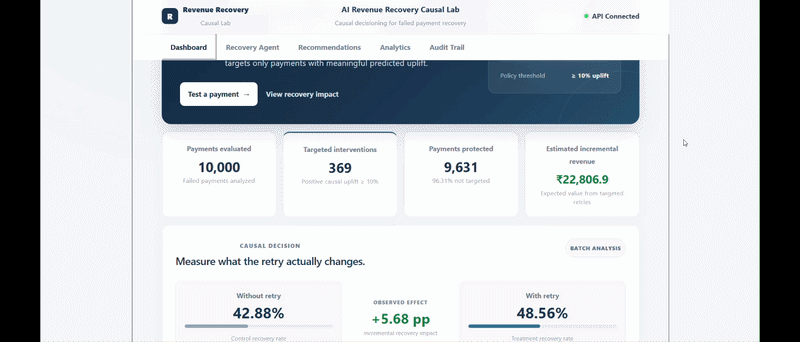
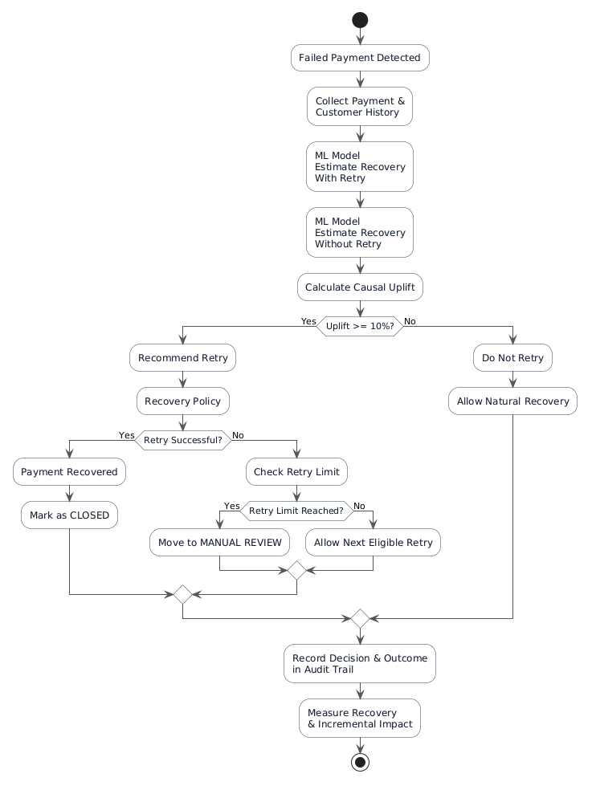

# AI Revenue Recovery Causal Lab

**Causal AI-powered payment recovery and incremental revenue optimization**

A full-stack decision system that identifies failed payments where a retry is expected to create incremental recovery, rather than blindly retrying every failed transaction.

The system estimates the treatment effect of a retry, applies a policy threshold, executes controlled recovery actions, and records every decision in an auditable trail.

> **Disclaimer:** This project uses simulated payment data and simulated recovery outcomes for demonstration purposes. The predicted uplift and incremental revenue figures are model/simulation outputs, not production payment-processing results.

---

## Table of Contents

1. [Live Demo](#live-demo)
2. [Problem](#problem)
3. [Solution](#solution)
4. [Key Features](#key-features)
5. [System Workflow](#system-workflow)
6. [Architecture](#architecture)
7. [Technology Stack](#technology-stack)
8. [API Endpoints](#api-endpoints)
9. [Example Decision](#example-decision)
10. [Protection Against Duplicate Actions](#protection-against-duplicate-actions)
11. [Current Demonstration Results](#current-demonstration-results)
12. [Recovery Execution Examples](#recovery-execution-examples)
13. [Project Structure](#project-structure)
14. [Running Locally](#running-locally)
15. [Example API Test](#example-api-test)
16. [Design Principles](#design-principles)
17. [Limitations](#limitations)
18. [Future Improvements](#future-improvements)
19. [Author](#author)

---

## Live Demo

Watch the deployed AI Revenue Recovery Causal Lab in action.



**Frontend:** https://revenue-recovery-causal-lab-frontend.onrender.com/

**Backend API:** https://revenue-recovery-causal-lab.onrender.com/

---

## Problem

Traditional payment recovery systems often use fixed retry rules such as:

> **"If a payment fails, try again."**

This can create unnecessary retries for payments that are unlikely to recover and does not distinguish between:

- Payments that benefit from a retry
- Payments that are unlikely to benefit
- Payments that should be reviewed manually

This project approaches recovery as a **causal decision problem**.

Instead of asking:

> **"Will this payment succeed?"**

the system asks:

> **"How much more likely is this payment to recover if we retry it?"**

---

## Solution

The system estimates two potential outcomes for each failed payment:

- **Probability with retry**
- **Probability without retry**

The difference between these outcomes is the predicted causal uplift.

```text
Causal Uplift =

P(Recovery | Retry) - P(Recovery | No Retry)
```

A policy gate then determines whether an intervention should be executed:

| Predicted Uplift | Decision |
| ---------------: | ------------ |
| ≥ 10% | Retry |
| < 10% | Do Not Retry |

This allows the system to focus recovery actions on payments where the intervention is predicted to provide meaningful incremental benefit.

The model recommends. The policy decides.

---

## Key Features

Causal uplift prediction for failed payments

Treatment vs. control recovery analysis

Policy-controlled retry decisions

Incremental revenue estimation

Recovery execution simulation

Maximum retry protection

Manual review routing for failed interventions

Already-processed payment protection

Recovery audit trail

React-based monitoring dashboard

FastAPI backend APIs

Deployed frontend and backend

---

## System Workflow



Payments below the intervention threshold are stopped by policy without executing a retry.

```text
Failed Payment

     │

     ▼

ML / Causal Prediction

     │

     ├── Probability with Retry

     │

     └── Probability without Retry

     │

     ▼

Predicted Uplift

     │

     ▼

Policy Threshold

     │

     ├── Uplift ≥ 10% ──► Retry

     │                         │

     │                         ├── Recovered ──► Closed

     │                         │

     │                         └── Failed ────► Manual Review

     │

     └── Uplift < 10% ──► Do Not Retry
```

---

## Architecture

```text
                    ┌──────────────────────┐
                    │       React UI       │
                    │  Monitoring Dashboard│
                    └──────────┬───────────┘
                               │
                               │ REST API
                               ▼
                    ┌──────────────────────┐
                    │    FastAPI Backend   │
                    ├──────────────────────┤
                    │ Recovery Service     │
                    │ Recovery Agent       │
                    │ Policy Engine        │
                    │ Audit Trail          │
                    └──────────┬───────────┘
                               │
                 ┌─────────────┴─────────────┐
                 ▼                           ▼
        ┌─────────────────┐         ┌─────────────────┐
        │ ML / Causal     │         │ Payment Dataset │
        │ Prediction      │         │ payments.csv    │
        └─────────────────┘         └─────────────────┘
```

---

## Technology Stack

### Frontend

React

Vite

Axios

CSS

### Backend

Python

FastAPI

Uvicorn

### Machine Learning

Python

Scikit-learn

Causal uplift modeling

Treatment/control outcome estimation

### Deployment

GitHub

Render

REST APIs

---

## API Endpoints

### Health Check

GET /

Returns the API service status.

### Recovery Summary

GET /api/recovery/summary

Returns overall payment and recovery information.

### Recovery Metrics

GET /api/recovery/metrics

Returns execution metrics such as:

- Payments evaluated
- Eligible payments
- Interventions executed
- Payments recovered
- Manual reviews
- Recovered revenue
- Execution recovery rate

### Recommendations

GET /api/recovery/recommendations

Returns payments ranked by predicted causal uplift and expected incremental revenue.

### Execute Recovery

POST /api/recovery/execute/{payment_id}

Runs the policy-controlled recovery decision for a payment.

### Audit Trail

GET /api/recovery/audit

Returns recorded recovery decisions and their outcomes.

---

## Example Decision

For a payment with:

| Metric | Value |
| ------------------------- | ------: |
| Amount | ₹131.55 |
| Probability with retry | 59.30% |
| Probability without retry | 39.58% |
| Predicted uplift | 19.71% |

Since:

```text
19.71% ≥ 10%
```

the policy allows a retry.

If the retry fails, the system does not continuously retry the payment. It reaches the maximum retry policy and routes the payment to:

Manual Review

This prevents uncontrolled intervention loops.

---

## Protection Against Duplicate Actions

The recovery agent maintains payment state.

If a payment has already reached a terminal state, another execution request does not trigger a new retry.

Example:

Payment: P06136

Decision: Retry

Result: Recovered

Next Action: Closed

A subsequent request returns:

Action: Already Processed

Status: Already Processed

This provides basic idempotent behavior for the recovery workflow.

---

## Current Demonstration Results

The deployed system currently evaluates:

| Metric | Value |
| ----------------------------- | ---------: |
| Payments evaluated | 10,000 |
| Eligible for retry | 369 |
| Payments not targeted | 9,631 |
| Interventions executed | 6 |
| Payments recovered | 3 |
| Manual reviews | 3 |
| Recovered transaction value | ₹934.67 |
| Execution recovery rate | 50.0% |
| Estimated incremental revenue | ₹22,806.90 |

The 369 eligible payments are those whose predicted causal uplift is at least 10%.

---

## Recovery Execution Examples

The demo includes multiple policy outcomes.

### Successful Recovery

Payment: P06136

Uplift: 10.08%

Decision: Retry

Result: Recovered

Next Action: Closed

### Policy Rejection

Payment: P03689

Uplift: -21.55%

Decision: Do Not Retry

Result: Not Executed

Next Action: No Intervention

### Failed Intervention

Payment: P09095

Uplift: 19.71%

Decision: Retry

Result: Failed

Next Action: Manual Review

These cases demonstrate that the system is not simply predicting "retry" — it also controls and records the resulting action.

---

## Project Structure

```text
revenue-recovery-causal-lab/

│

├── backend/

│   ├── app/

│   │   ├── main.py

│   │   ├── recovery_service.py

│   │   └── recovery_agent.py

│   │

│   └── ml/

│       ├── generate_data.py

│       ├── train_model.py

│       ├── causal_model.py

│       └── analyze_recovery.py

│

├── data/

│   └── payments.csv

│

├── frontend/

│   ├── src/

│   │   └── App.jsx

│   ├── package.json

│   └── vite.config.js

│

├── demo/

│   └── recoveryclab.gif

│

├── tests/

├── archirevflow.png

├── requirements.txt

└── README.md
```

---

## Running Locally

### 1. Clone the Repository

```bash
git clone https://github.com/Blessy-K/revenue-recovery-causal-lab.git
cd revenue-recovery-causal-lab
```

### 2. Backend Setup

Create and activate a virtual environment:

```bash
python -m venv venv
```

Windows:

```bash
venv\Scripts\activate
```

Install dependencies:

```bash
pip install -r requirements.txt
```

Start FastAPI:

```bash
uvicorn backend.app.main:app --reload --port 8000
```

Backend:

```text
http://127.0.0.1:8000
```

### 3. Frontend Setup

Open another terminal:

```bash
cd frontend
npm install
npm run dev
```

Frontend:

```text
http://localhost:5173
```

---

## Example API Tests

Check the recommendations:

```bash
curl http://127.0.0.1:8000/api/recovery/recommendations
```

Execute a recovery decision:

```bash
curl -X POST http://127.0.0.1:8000/api/recovery/execute/P09095
```

Check the audit trail:

```bash
curl http://127.0.0.1:8000/api/recovery/audit
```

---

## Design Principles

### 1. Intervention Over Prediction

The objective is not simply to predict whether a payment will recover.

The system estimates whether taking an action changes the expected outcome.

### 2. Policy-Controlled Automation

Machine learning does not directly execute unlimited retries.

The policy layer determines whether the predicted benefit is large enough to justify intervention.

### 3. Incremental Revenue

The system focuses on the revenue attributable to the intervention rather than treating every recovered payment as automatically caused by the retry.

### 4. Safe Execution

Recovery attempts are bounded and terminal states prevent duplicate interventions.

### 5. Auditability

Every decision records:

Payment ID

Predicted uplift

Decision

Action

Result

Retry attempt

Recovered amount

Incremental revenue

Stop reason

Next action

---

## Limitations

This project uses a simulated payment dataset and simulated recovery outcomes for demonstration purposes.

The predicted uplift and incremental revenue figures should therefore be interpreted as model/simulation outputs, not production payment-processing results.

A production implementation would require:

- Real payment gateway integration
- Online experimentation
- Robust causal identification
- Model monitoring
- Feature drift detection
- Fraud and risk controls
- Customer communication policies
- Stronger persistence and distributed state management

---

## Future Improvements

Real payment gateway integration

Online A/B experimentation

More advanced uplift modeling

Model explainability

Real-time feature pipelines

Persistent recovery state

Retry scheduling and cooldown windows

Cost-aware intervention optimization

Monitoring and alerting

Automated model retraining

---

## Author

Blessy K.

B.Tech — Computer Science & Engineering (Data Science)

ACE Engineering College, Hyderabad

GitHub: https://github.com/Blessy-K/revenue-recovery-causal-lab